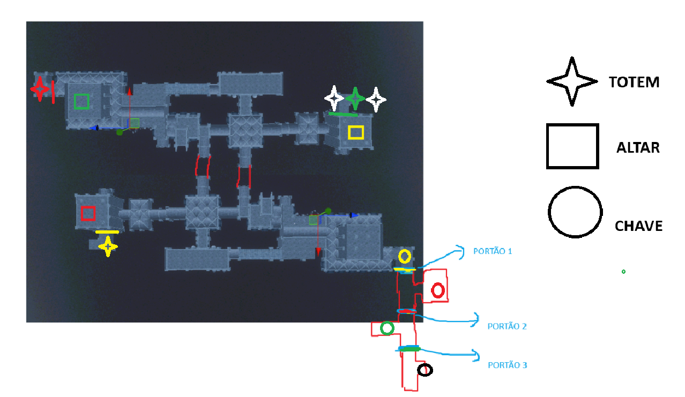

# **VEIL OF AGONY**

## Objetivo
*O objetivo é escapar da masmorra, atravessando três portões trancados, cada um liberado por um ritual. Enquanto busca os elementos necessários, o jogador deve evitar a criatura com o véu.*

## MAPA

## Cutscenes
### Cena 1 - Início
Você acorda no chão gelado de uma cela escura, o ar fedendo a mofo e sangue, sons de água gotejando em algum canto distante. Gritos desesperados ecoam pelo corredor, cortando o silêncio. Um prisioneiro surge diante das grades, se arrastando, deixando um rastro de sangue. Seus olhos arregalados imploram por ajuda, mas ele só gorgoleja antes de sumir na escuridão.

Passos lentos e pesados se aproximam. Uma criatura alta, coberta por um véu esfarrapado, passa pela sua cela, arrastando uma maça ensanguentada que pinga no chão. Ela segue o prisioneiro. Silêncio. Então, um grito horrível, seguido por três baques úmidos: thud, thud, thud. Um som de carne esmagada.

Você encontra um buraco estreito na parede. Rasteja por ele, o túnel apertado e escuro, com apenas fiapos de luar iluminando o caminho. O ar é sufocante, e você jura ouvir algo rastejando atrás de você. Chega ao fim do túnel e vê o prisioneiro — ou o que sobrou dele. O corpo está completamente destroçado e irreconhecível, membros retorcidos, crânio afundado e sangue espalhado por toda parte.

OBS:Você encontra uma tocha apagada sobre um balcão. Olha para a lareira; há um brilho sutil contornando o objeto, indicando onde você pode acender a tocha.

Você está ferido, ao caminhar pelo corredor encontra uma bandagem para se curar.

### Cena 2 - Fim
Com os três rituais concluídos, um estalo metálico ecoa: a última porta se abre. A liberdade está ao seu alcance. Você corre por um corredor estreito em direção a uma fraca luz — um vislumbre da floresta.

Mas, antes de sair, uma sombra imensa bloqueia a saída. O Executor surge, impedindo seu caminho. A perseguição é implacável. Com um último esforço, você o despista, volta rapidamente e finalmente escapa.

## Mêcanica Geral
* O jogador pode pegar um objeto por vez (totem, jarras com óleo, chave, bandagem e tijolo(opcional))
* **Jarro com óleo:** 
    * 5 unidades espalhadas aleatoriamente.
    * ao consumir o óleo do jarro, o jarro desaparece.
* **Totens e chaves:**
    * 3 unidades posicionadas em lugares fixos.
    * Ao destrancar a cela com a chave, a chave desaparece.
    * Ao realizar o ritual, o totem ficará com um
* **Bandagem:**
    * 2 unidades espalhadas aleatoriamente.
    * Ao consumir a bandagem, a bandagem utilizada desaparece e outra unidade surge aleatoriamente, mantendo 2 unidades pelo mapa.
* **Tijolo (opcional):**
    * 10 Unidades espalhadas aleatoriamente.
    * Ao arremessar o tijolo, ele quebra, fazendo barulho e atraindo o executor no local do impacto, o tijolo desaparece.

### Tocha
* Brilho da tocha diminui a cada 5 minutos:
    * Forte
    * Medio
    * Fraco
* Fogueiras restauram o brilho para o nível Forte.

## Mecânica do ritual
* Existem três altares, cada um com uma marca única.
* Existem três totens, protegidos por obstáculos que exigem chaves para acesso.
* Cada totem deve ser queimado no altar correspondente.
* Para cada parte do ritual concluído, um portão se abre, possibilitando encontrar uma chave para desbloquear o próximo totem.
* Etapas do ritural:
    1. Colocar o totem sobre o altar
    2. Despejar o jarro de óleo sobre o totem
    3. Incinear o totem com a tocha
* Enquanto o totem é incinerado, as chamas podem realçar cores como azul, verde ou roxo. Produzir efeitos sonoros de gritos, como se o totem tivesse vida.
* Após o totem ser incinerado, ele terá uma aparência preta com fissuras vermelhas brilhando , saindo fumaça,indicando que o totem foi consumido.
* Cada ritual completado aumenta o nível do Executor em +1.
* Ritual concluído = Executor em estado de frenesi.
### Totem 1
* Trancado em uma cela.
### Totem 2
* Trancado em uma cela.
### Totem 3
* Trancado em uma cela com dois totens falsos. Todos têm a marca borrada.

### Executor
* **Área de foco:** Se o jogador entrar nela, o Executor sai do modo patrulha e inicia perseguição.
* **Ataque:** Acertar o jogador o faz retornar à patrulha.
* **Frenesi:** Patrulha correndo por 15 segundos após cada ritual.
* **Nível 1:** 
    * velocidade patrulhando: 40%
    * velocidade perseguindo: 110% 
    * Área patrulhando:
      * prisioneiro andando: 100%
      * prisioneiro correndo: 90%
    *  Área de foco durante perseguição: 100%
* **Nível 2:**
    * velocidade patrulhando: 50%
    * velocidade perseguindo: 110% 
    * Área patrulhando:
      * prisioneiro andando: 75%
      * prisioneiro correndo: 65%
    *  Área de foco durante perseguição: 110%
* **Nível 3:**
    * velocidade patrulhando: 60%
    * velocidade perseguindo: 110%
    * Área patrulhando:
      * prisioneiro andando: 50%
      * prisioneiro correndo: 40%
    *  Área de foco: 120%
### Prisioneiro
O jogador terá dois estados de saúde:
* Saudável:
  * **Estamina:** Velocidade: 130% por 6s (Tempo de recarga após o fim do efeito: 15s).
  * **Correr:** velocidade: 100%.
  * **Andar:** Velocidade: 40%.
* Ferido: (após ser atacado) Indicador vermelho como sangue em volta da tela.
  * **Estamina:** Velocidade: 120% por 6s (Tempo de recarga após o fim do efeito: 15s).
  * **Correr:** velocidade: 80%.
  * **Andar:** Velocidade: 35%.
  * Segundo ataque = morte.
  * **Auto cura:** Usar bandagem retorna ao estado saúdavel.

## Mecânica de terror psicológico
### Visual
* As tochas e velas piscam aleatoriamente, criando momentos de escuridão total.
### Auditiva
* Sons emitidos pelo Executor: cânticos guturais, passos pesados, metal arrastando.
* Esses sons ficam mais altos quando ele está próximo, mas ecoam de forma enganosa nos corredores.
* Outros sons: Sussurros, gritos, correntes caindo, vento uivando, tocha queimando.
* Trilha sonora reforça a sensação de perseguição, mantendo o jogador em alerta constante.
### Armadilhas sonoras
* Áreas com chão instável, correntes ou cacos causam barulho se o jogador correr, atraindo o Executor.

## Mecânicas Secundárias - Opcional
### Sanidade
* Diminui ao presenciar horrores ou ficar muito tempo no escuro.
* Alucinações visuais e sonoras: vozes, vultos (que atacam), ruídos falsos.
* Sanidade se recupera em áreas iluminadas ou ao concluir rituais, mas isso atrai o Executor.
### Esconderijos
* Presentes nos corredores (barris, armários, sombras).
* Usar esconderijo consome sanidade.
* O jogador deve controlar a respiração (minijogo de pressionar botões no ritmo) para não fazer barulho enquanto escondido. Falhar alerta o Executor.
### Atordoar o executor
* Crucifixos podem ser usados para atordoar por 5 segundos.
* Apontar corretamente durante perseguição é necessário, o executor volta para o estado de patrulha.
### Distração
* Tijolos podem ser arremessados para atrair o Executor ao ponto de impacto.

## Historia
Em uma cidade isolada, esquecida pelo tempo e escondida do mundo exterior, uma seita secreta manipulava cada decisão política, cada autoridade, cada passo da população. Sob aparência de normalidade, os cultistas controlavam a cidade nas sombras, conduzindo rituais profanos e invocando criaturas abomináveis para manterem-se no poder — e alimentar a corrupção que sustentava o Estado desde suas fundações.

Entre suas aberrações invocadas, a mais temida era o Véu: uma entidade indestrutível, sem rosto, sem alma, criada para ser o carcereiro eterno de uma masmorra secreta.
Por séculos, o Véu patrulha os corredores escuros do calabouço, garantindo que nenhum prisioneiro escape.
Quando isso acontece... ele não captura. Ele executa.

A seita possui métodos de apagar a mente dos que se opõem ao regime. Todo rebelde, todo curioso... desaparece. Sem rastros, sem memória, sem identidade.

Com o passar do tempo, a sociedade cresceu, e a verdade foi enterrada sob camadas de mentiras. Os horrores da seita viraram histórias distorcidas, contos esquecidos. O Véu, antes temido como uma entidade real, tornou-se apenas uma lenda usada para assustar crianças. As pessoas passaram a duvidar, rir, esquecer. Enquanto isso, a seita continuava agindo nas sombras — manipulando, corrompendo e eliminando qualquer ameaça em silêncio.

Apesar do esquecimento coletivo, ainda existiam aqueles que buscavam a verdade. Curiosos, rebeldes, céticos — poucos, mas determinados. Eles seguiam rastros apagados, fragmentos de histórias antigas, tentando provar que a lenda era real… e que o mal nunca havia desaparecido.

Um desses dissidentes foi Silas — um jovem prodígio e extremamente inteligente. Silas havia descoberto a verdade por trás dos cultistas: seus pactos, seus crimes, seus rituais — tudo documentado em um caderno de anotações secretas.

Porém, antes que pudesse expor a verdade ao mundo, foi capturado.

Silas foi torturado, sua mente apagada, sua liberdade arrancada, e trancado nas profundezas da masmorra. Mesmo debilitado, ele conseguiu escrever novas anotações em seu caderno, usando o próprio sangue como tinta e por meio de suas anotações, retomava conciência da situação, mesmo que em partes. Nelas, descrevia detalhes sobre o Véu, padrões de patrulha, falhas na segurança e possíveis formas de escapar.
Na sua última tentativa de fuga, foi morto brutalmente pela entidade.

Suas anotações, no entanto, não foram perdidas — estão espalhadas pelos corredores sombrios da masmorra, à espera de serem encontradas por alguém corajoso o suficiente para continuar sua luta.

Meses depois, seu irmão Elias decide investigar seu desaparecimento. Ao seguir pistas e rumores, descobre a verdade, mas também é descoberto.

Capturado pelos cultistas e lançado à mesma masmorra, Elias agora enfrenta o mesmo destino.

Elias acordou na masmorra sem lembrar de nada — nem seu nome, nem o motivo de estar ali. Vagando pelos corredores escuros, encontrou páginas manchadas de sangue com mensagens diretas: instruções, verdades ocultas, advertências sobre uma entidade chamada Véu.

Elias seguiu as pistas. Usou cada palavra deixada como arma. Evitou o Véu por pouco, realizou o ritual para quebrar o selo que o trancava na masmorra.

O ritual funcionou. O selo se quebrou, e os portões da masmorra se abriram. A luz do mundo exterior tocou sua pele pela primeira vez em semanas — talvez meses. Exausto, ensanguentado, mas livre, ele correu até não conseguir mais.

Elias caminhou por dias, guiado apenas pela vontade de sobreviver e pela memória fragmentada das anotações de Silas. Quando finalmente alcançou os arredores da cidade, desabou em frente a uma pequena comunidade rural, esquecida pelo tempo como tudo naquela região.

Foi acolhido por alguns moradores, que estranharam seu estado: roupas rasgadas, pele marcada por feridas, olhos fundos e uma expressão assombrada. Após repousar, comeu pela primeira vez em semanas. E então, quando conseguiu juntar forças, falou.

Contou tudo.

Sobre a seita secreta que controlava a cidade.

Sobre o Véu — a entidade que caçava e executava.

Sobre os rituais proibidos, os pactos sangrentos, as pessoas que desapareciam.

Sobre as anotações.

Sobre a masmorra.

Sobre o horror.

Alguns riram. Outros sussurraram entre si. As crianças foram afastadas. Disseram que ele era apenas mais um louco doente, consumido por delírios.

Mesmo assim, alguns poucos olharam para ele com olhos diferentes. Não de medo, nem de deboche. Mas de compaixão. Talvez fé. Ou medo de que fosse verdade.

Três pessoas se ofereceram para segui-lo.

Guiados por Elias, eles partiram até o local onde ficava a entrada da masmorra — um velho desfiladeiro coberto por raízes e musgo, escondido atrás de uma formação rochosa.

Mas ao chegarem… não havia nada.

Nem o portão, nem os símbolos, nem as pedras ensanguentadas.
A rocha estava intacta, como se jamais tivesse sido tocada.
Como se nunca houvesse existido masmorra alguma.

O silêncio pesou.

Elias caiu de joelhos. Tremeu.

Os outros o encaravam, agora hesitantes.

A compaixão se esvaía, dando lugar à incerteza.

E aos poucos.. um por um, foram se afastando.

Menos um.

O velho se aproximou, ajoelhou-se ao seu lado e sussurrou:

— "Eles enterraram a verdade antes... e farão de novo. Você deveria agradecer por ainda estar respirando. Desista, garoto. A seita não pode ser exposta."

O velho permaneceu em silêncio por um instante, observando a paisagem vazia onde antes existia a entrada da masmorra. Depois se virou lentamente para Elias, e, pela primeira vez, seus olhos não carregavam apenas cansaço — mas algo mais fundo. Escuro. Antigo.

Ajoelhou-se novamente, aproximando-se até que sua voz mal passasse de um sussurro:

— “Você viu demais. Lembrou demais. Falou demais.”

Elias recuou, desconfiado, mas o velho continuou, sem alterar o tom:

— “Eles não o mataram. Isso significa algo. Talvez gostem de você. Ou talvez... estejam te testando.”

Ele suspirou, fechou os olhos por um segundo, e então disse:

— “Escute com atenção, garoto. Você pode ir embora. Pode esquecer tudo isso. Fingir que nada aconteceu. Que a masmorra era um sonho ruim. Viver uma vida tranquila, longe daqui. Se fizer isso... será deixado em paz.”

O velho tocou o ombro de Elias, firme:

— “Mas se continuar cavando... se seguir tentando expor o que não deve ser visto... eles voltarão por você. E da próxima vez, nem o Véu precisará aparecer. A decisão é sua, Elias. A verdade... ou a vida.”

Então se ergueu, virou-se de costas, e desapareceu entre as árvores — sem deixar pegadas.